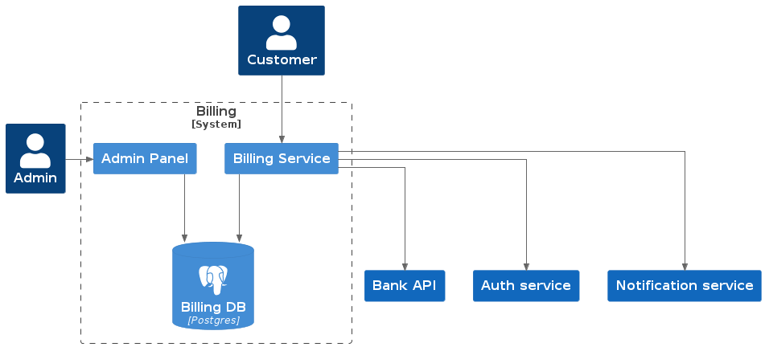

# Проектная работа: диплом

Выбранная тема: биллинг

# Функциональные требования

1. Однократная оплата подписки
2. Оплата с автопродлением
3. Возврат денег за подписку: вычисляется по функции, учитывающей использованное время
4. Админ-панель
   1. Оплата
   2. Возвраты: одобрение и отклонение
   3. Подписки
   4. Подписки пользователей

# Ссылка на репозиторий

https://github.com/likeinlife/graduate_work

# Авторы

- @likeinlife
- @maxim-zaitsev
- @jannyss
- @BenderEg

# Запуск и остановка

- `make env` - первое, что нужно сделать - сформировать .env файл.

## DEV (mock платежный сервис, красивые логи, дебаг, не запускается ELK)

1. `make up` - запустить все необходимые компоненты системы в dev-режиме
2. `make create-admin email=<email> password=<password>` - создать админ-пользователя. Примечательно, что пароль должен быть больше 6 символов. Например: `make create-admin email=123@mail.ru password=123qwe`
3. `make downv` - удаление контейнеров и volume

## PROD (ЮКасса, ELK, логи - json)

1. см. [примечания для prod-режима](#примечание-для-prod-режима)
1. `make p-up` - запустить все необходимые компоненты системы в dev-режиме
2. `make p-create-admin email=<email> password=<password>` - создать админ-пользователя. Примечательно, что пароль должен быть больше 6 символов. Например: `make create-admin email=123@mail.ru password=123qwe`
3. `make p-downv` - удаление контейнеров и volume

# Тестовый сценарий (dev)

1. Запустить сервис, создать админа
2. Залогиниться на http://localhost:8001/api/openapi на ручке `api/v1/auth/signin`
3. Перейти на http://localhost:8000/admin, залогиниться, создать объект `Subscriptions`, скопировать id
4. Перейти на http://localhost:8000/api/schema/swagger-ui, создать объект payments с помощью ручки `/payments/`
5. Вернуть платеж с помощью `/payments/refund/`
6. Перейти в админку, модель `Refunds`, вернуть с помощью actions

# Примечание для prod-режима

В dev-режиме используется мок-сервис оплаты, в prod - ЮКасса.

Соответственно, для запуска приложения в prod-режиме необходимо получить ключи ЮКассы и записать в переменные окружения перед запуском (`BILLING_SHOP_ID`, `BILLING_SECRET_KEY`)
Также нужен публичный ip-адрес, можно использовать ngrok, прописав ip-адрес в `BILLING_REDIRECT_URL`

# Основные компоненты сервиса

