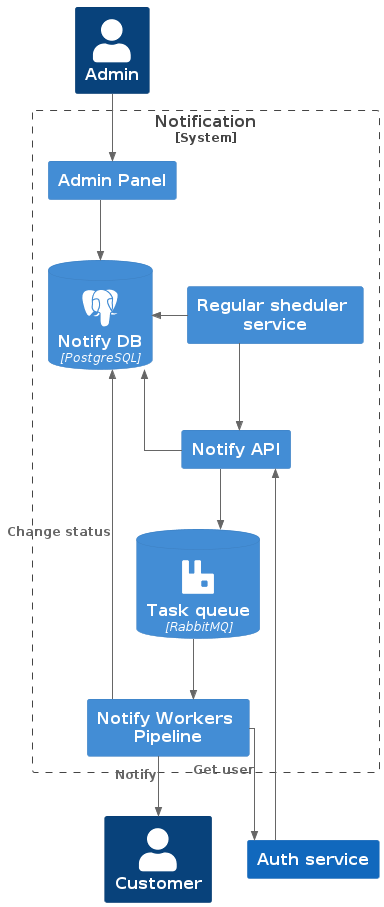
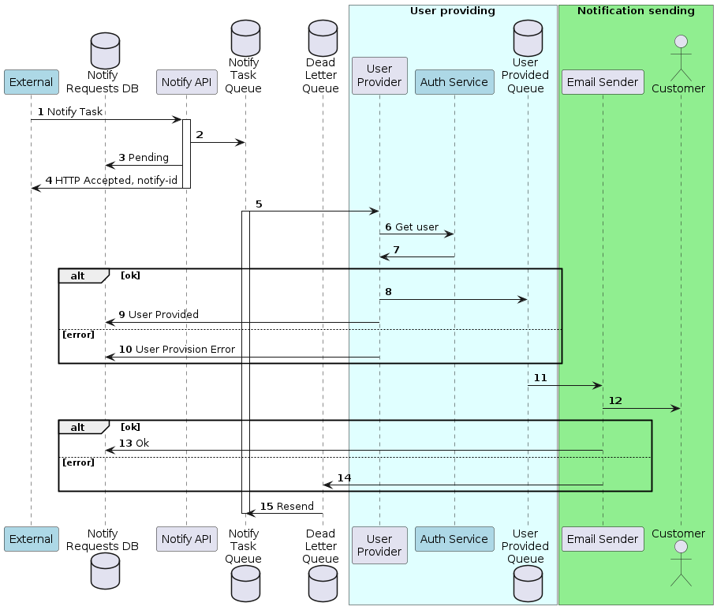

# Описание

Сервис отправки уведомлений для пользователя.
На данный момент реализовано уведомление по SMTP.
Сервис реализован по принципу pipeline, прослойками между микро-сервисами которого служат очереди RabbitMQ. 

Ссылка на репозиторий: `https://github.com/likeinlife/notifications_sprint_1`

# Авторы

* [@likeinlife](https://github.com/likeinlife)
* [@maxim-zaitsev](https://github.com/maxim-zaitsev)
* [@yandexwork](https://github.com/yandexwork)

## Вклад @likeinlife

- Оформление репозитория
- Создание диаграм
- Конфигурирование переменных окружения
- Пайплайн сервиса нотификации: получение юзеров, отправка уведомлений
- Настройка RabbitMQ: dead-letter-queue, exchanges, queues

## Вклад @maxim-zaitsev

- Создание админ-панели
- Создание сервиса регулярных уведомлений
- Конфигурирование nginx

## Вклад @yandexwork

- Написание АПИ
- Написание тестов АПИ

# Тестирование

- `make test`

# Сервисы

# Пайплайн

